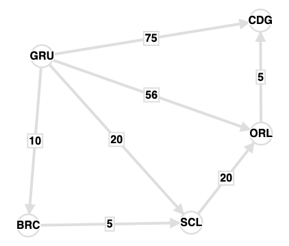

# Rota de Viagem

## Problema

Um turista deseja viajar pelo mundo pagando o menor preço possível independentemente do número de conexões necessárias.
Vamos construir um programa que facilite ao nosso turista, escolher a melhor rota para sua viagem.

Para isso precisamos inserir as rotas através de um arquivo de entrada.

## Input Example

```csv
GRU,BRC,10
BRC,SCL,5
GRU,CDG,75
GRU,SCL,20
GRU,ORL,56
ORL,CDG,5
SCL,ORL,20
```

## Explicando

Caso desejemos viajar de **GRU** para **CDG** existem as seguintes rotas:

1. GRU - BRC - SCL - ORL - CDG ao custo de **\$40**
2. GRU - ORL - CGD ao custo de **\$64**
3. GRU - CDG ao custo de **\$75**
4. GRU - SCL - ORL - CDG ao custo de **\$48**

O melhor preço é da rota **1** logo, o output da consulta deve ser **GRU - BRC - SCL - ORL - CDG**.

## Solução

Uma das soluções deste problema é utilazando o algoritmo Dijkstra, pois o problema de rotas de viagem se enquadra no problema de achar o melhor caminho em um grafo, onde cada vertice de um grafo representa a localização do aeroporto (ex: GRU) e cada distancia entre dois vertices seria o custo de rota.

Para a entrada acima, podemos construir o Grafo a seguir:



### Estrutura do Projeto

```
├── README.md
├── main.js  // Para execução via console
├── package.json // Dependencias e scripts para node.js
├── src
│   ├── index.js // Servidor
│   ├── assets
│   │   └── GraphImage.png
│   ├── config
│   │   └── jsDoc
│   │       └── index.js
│   ├── routes
│   │   ├── index.js
│   │   └── path
│   │       ├── index.js
│   │       └── schemas.js
│   ├── services
│   │   ├── File
│   │   │   └── index.js
│   │   ├── Graph
│   │   │   └── index.js
│   │   └── TravelPath
│   │       └── index.js
│   ├── test
│   │   └── travelPath.spec.js
│   └── utils
│       ├── ErrorMessages.js
│       └── Validator.js
└── temp
    └── files
        └── input-routes.csv
```

Nesse projeto foi adotado os principios SOLID.

### Execução do programa

A instalação das dependencias via linha de comando

```shell
npm install
```

A inicialização dos testes unitarios se dará por linha de comando

```shell
npm run test
```

> Ao executar o comando de teste, os arquivos dentro da pasta **temp/files** serão removidos. para realizar o teste de inserção do inicio

### Duas interfaces de consulta são implementadas

- A execução da interface de console via linha de comando:

```shell
node main input-routes.csv
```

> O arquivo deve ser colocado na pasta **temp/files**

- A Interface de console deverá receber um input com a rota no formato "DE-PARA" e imprimir a melhor rota e seu respectivo valor.
  Exemplo:

  ```shell
  please enter the route: GRU-CGD
  best route: GRU - BRC - SCL - ORL - CDG > $40
  please enter the route: BRC-CDG
  best route: BRC - SCL - ORL - CDG > $30
  ```

  > Para para a aplicação digite: exit

- Interface Rest
  A interface Rest permite:
  - Registro de novas rotas. Essas novas rotas serão persistidas no arquivo csv utilizado como input(input-routes.csv),
  - Consulta de melhor rota entre dois pontos.

### Execução da aplicação REST

```shell
npm start
```

#### Inserir nova rota

Faça uma chamada POST

```
POST: http://localhost:3000/v1/path
```

#### Body da requisição

```json
{
  "from": "GRU",
  "to": "BRC",
  "cost": 10
}
```

#### Consultar o caminho mais barato entre dois pontos

Faça uma chamada GET

```
GET: http://localhost:3000/v1/path/GRU-CGD
```

**Resultado:**

```json
{
  "message": "GRU - BRC - SCL - ORL - CDG > $40"
}
```
